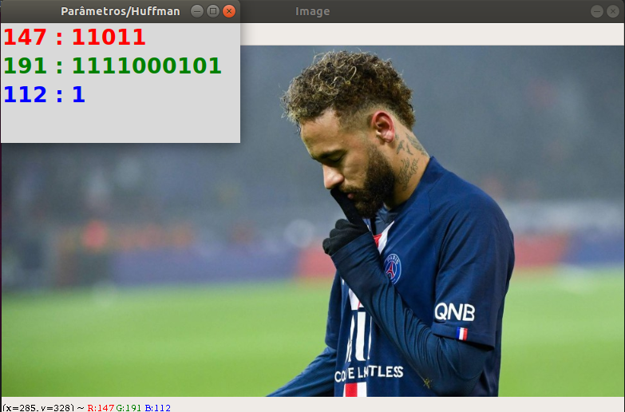
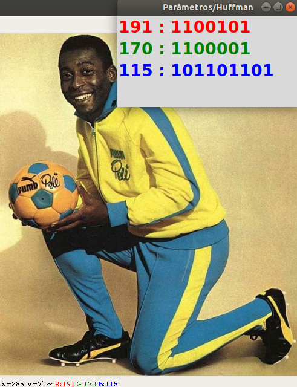

# Encode Huffman

**Número da Lista**: 3 
**Conteúdo da Disciplina**: Greed 

## Alunos
|Matrícula | Aluno |
| -- | -- |
| 17/0138551  | Bruno Duarte |
| 17/0033112  | Eugênio Sales |

## Sobre 
O projeto visa demonstrar a codificação de Huffman em imagens onde cada imagem possui uma matriz RGB represantando suas cores com o balanceamento de parâmetros. A partir de cada filtro é gerado uma tabela em txt representando o algoritmo de Huffman. 

## Screenshots

## Instalação 

**Linguagem**: python3 

`$ pip install pandas ` 

`$ sudo apt-get install python-tk` 

`$ pip install numpy ` 

> Nota: Utilize pip ou pip3 para instalar as depêndencias

## Uso 

Execute com: 

`$ python3 main.py ` 

A imagem é aberta a partir daí ao dar **duplo clique** sobre a imagem aparecerá a codificação e seus respectivos valores, a label com as informações é dada e esse padrão pode ser repetido n vezes em qualquer região delimitada pela imagem.

